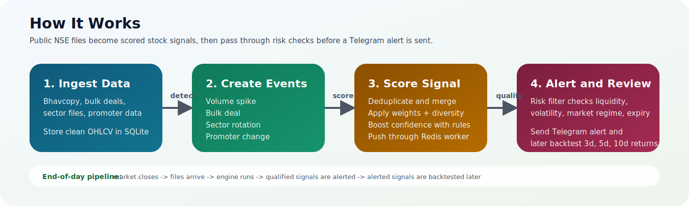
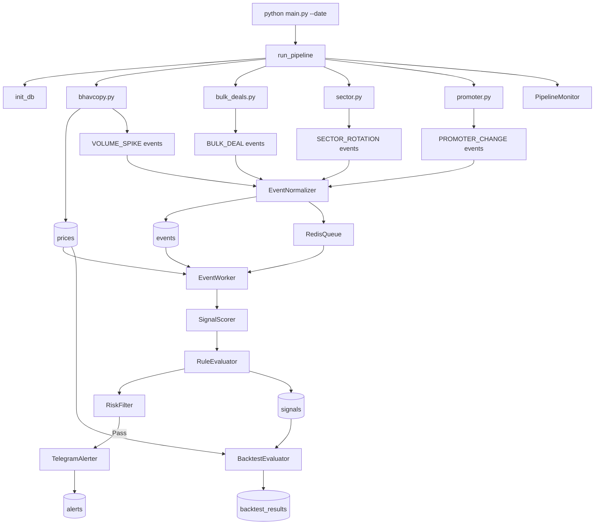

# Event-Driven Stock Signal Engine

[](https://www.python.org/)
[](https://www.sqlite.org/)
[](https://redis.io/)
[](https://core.telegram.org/bots/api)
[](https://pytest.org/)



A post-market signal pipeline for Indian equities. Pulls NSE public data every evening, detects unusual activity, scores it, filters noise, and fires Telegram alerts for stocks worth watching.

No tick-by-tick streaming. No paid data feeds. Just bhavcopy, bulk deals, sector files, and shareholding patterns — processed after market close.

---

## Architecture



---

## How it works

1. Downloads NSE bhavcopy and parses OHLCV data
2. Detects volume spikes, bulk deal activity, sector rotation, and promoter holding changes
3. Normalizes and deduplicates all events
4. Pushes them through Redis into a worker queue
5. Scores grouped events into a single confidence value
6. Applies rule-based boosts and risk filters
7. Sends a Telegram alert if the signal clears the threshold
8. Backtests alerted signals later using forward returns

Each pipeline phase is wrapped in a safe runner — if one fails, the rest still run. If Redis isn't available, it falls back to an in-memory queue automatically.

---

## Project layout

```
signal_engine/
├── producers/        # bhavcopy, bulk_deals, sector, promoter
├── validation/       # data quality checks, backtest evaluation
├── normalization/    # dedup and diversity scoring
├── queue/            # Redis queue with in-memory fallback
├── workers/          # event consumer and signal builder
├── scoring/          # confidence formula
├── rules/            # score boost combinations
├── risk/             # liquidity, volatility, regime filters
├── alerts/           # Telegram sender
├── monitoring/       # structured JSON logs
├── db/               # SQLite schema
└── config/           # settings.yaml, rules.yaml

frontend/             # basic web UI
tests/                # pytest suite
main.py               # entry point
```

---

## Setup

1. Clone and enter the repo:
```bash
git clone https://github.com/elvishpatel/SignalEngine/
cd signal_engine
```

2. Create and activate a virtual environment:
```bash
py -3.10 -m venv .venv
.\.venv\Scripts\Activate.ps1
```

3. Install dependencies:
```bash
pip install -r requirements.txt
```

4. Copy `.env.example` to `.env` and fill in your Telegram credentials:
```
TELEGRAM_TOKEN=your_bot_token_here
TELEGRAM_CHAT_ID=your_chat_id_here
```

5. Start Redis:
```bash
docker run -d --name redis-local -p 6379:6379 redis:7
```

6. Initialize the database:
```bash
python -m signal_engine.db.schema
```

7. Run tests:
```bash
pytest tests -q
```

8. Run the pipeline:
```bash
python main.py --date 2026-04-29
```

9. Or run on a schedule:
```bash
python main.py --schedule
```

Keep the machine timezone set to IST if you're scheduling for Indian market hours.

---

## Configuration

`signal_engine/config/settings.yaml` controls all runtime behaviour.

| Setting | Default | What it controls |
|---|---|---|
| `volume_spike.zscore_threshold` | 2.5 | How unusual volume needs to be |
| `risk_filter.min_avg_volume` | 100,000 | Minimum liquidity to pass |
| `risk_filter.max_volatility` | 0.05 | Maximum 20-day volatility |
| `risk_filter.min_confidence` | 3.0 | Minimum score to create a signal |
| `alert_threshold` | 5.0 | Minimum score to send an alert |
| `signal_weights.BULK_DEAL` | 0.35 | Weight in confidence formula |

Rule boosts are in `rules.yaml`. For example, `BULK_DEAL + SECTOR_ROTATION` adds +10 to confidence.

---

## Debugging no alerts

Quick DB check to find where the pipeline stopped:

```bash
python -c "
import sqlite3
c = sqlite3.connect('signal_engine.db')
for t in ['prices','events','signals','alerts']:
    print(t, c.execute(f'select count(*) from {t}').fetchone()[0])
"
```

**Prices exist but no events** — no threshold was crossed. Volume wasn't unusual enough, no bulk deals, no sector rotation, or no promoter change above 1%.

**Events exist but no signals** — check Redis. Worker may not have drained the queue correctly.

**Signals exist but no alerts** — confidence is below `alert_threshold` or a risk filter blocked it (low volume, high volatility, bearish market regime, or expired signal).

**Telegram works manually but pipeline sends nothing** — Telegram setup is fine, the blocker is earlier in the chain. Use the DB check above to find where it stopped.

---

## Contributing

Built by [Elvish Patel](https://github.com/elvishpatel).

PRs are welcome. If you're adding a new event producer, follow the same structure as any file in `signal_engine/producers/` and include at least one test in `tests/test_producers.py`.

For non-trivial changes, open an issue first so we can align before you spend time building. Keep PRs focused — one change per PR makes review a lot easier.
