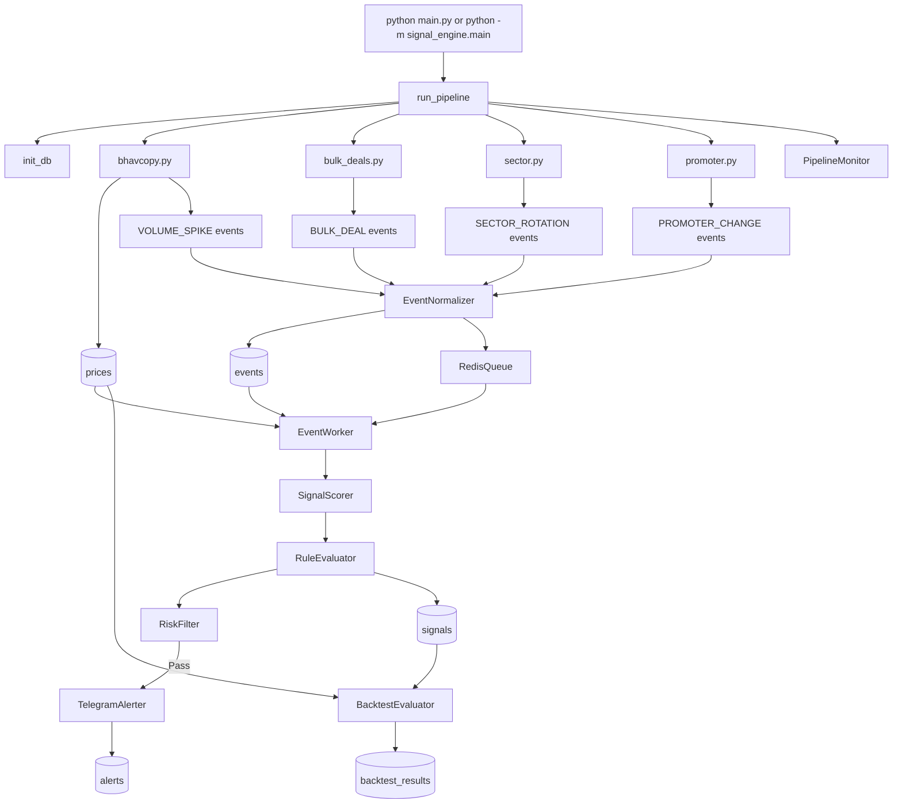

# Event-Driven Stock Signal Engine

 
[](https://www.python.org/)
[](https://www.sqlite.org/)
[](https://redis.io/)
[](https://core.telegram.org/bots/api)
[](https://pytest.org/)


A post-market event-driven stock signal pipeline for Indian equities using NSE public market files.
The engine ingests daily market data, detects event patterns, scores confidence, filters risk, and sends Telegram alerts for qualified signals.

## Overview

This project turns public market data into tradeable stock signals.

In simple terms:

1. Download daily market data.
2. Detect unusual market activity.
3. Convert that activity into events.
4. Combine same-stock same-day events.
5. Score them into one confidence value.
6. Apply rule boosts and risk filters.
7. Send Telegram alerts.
8. Backtest alerted signals later.


## Important Note About "Realtime"

This project is not tick-by-tick intraday streaming.
It is designed as a post-market or end-of-day pipeline.

Why:

- The main price source is NSE bhavcopy.
- Bulk deals, sector lists, and promoter/shareholding data are file-based public sources.
- Those sources are naturally processed after market activity is already recorded.

So in practical use, the normal workflow is:

```text
Market closes -> Files become available -> Pipeline runs -> Alerts sent
```

## Architecture Diagram



## How the Pipeline Works

When you run:

```powershell
python main.py --date 2026-04-29
```

the orchestrator in `signal_engine/main.py` does this:

1. Opens or creates the SQLite database.
2. Downloads and parses bhavcopy.
3. Validates price quality.
4. Stores valid price rows in `prices`.
5. Downloads bulk deals and emits `BULK_DEAL` events.
6. Detects `VOLUME_SPIKE` events from historical price/volume data.
7. Loads sector membership and emits `SECTOR_ROTATION` events.
8. Downloads promoter/shareholding files and emits `PROMOTER_CHANGE` events.
9. Normalizes and deduplicates all events.
10. Pushes normalized events into Redis.
11. Worker drains the queue.
12. Worker groups same-stock same-day events.
13. Scoring engine calculates confidence.
14. Rule evaluator applies score boosts.
15. Risk filter rejects unsafe signals.
16. Telegram alerter sends alerts for qualified signals.
17. Backtest evaluator later measures performance of alerted signals.
18. Monitoring logger records pipeline status and queue health.

Important behavior in the current code:

- each pipeline phase is wrapped in a safe runner
- if one phase fails, the pipeline logs the failure and continues to the next phase where possible
- this makes the run more resilient during live operation

## Project Structure


```text
.
|-- signal_engine/
|   |-- alerts/
|   |   |-- __init__.py
|   |   `-- telegram.py
|   |-- config/
|   |   |-- rules.yaml
|   |   `-- settings.yaml
|   |-- db/
|   |   |-- __init__.py
|   |   `-- schema.py
|   |-- monitoring/
|   |   |-- __init__.py
|   |   `-- logger.py
|   |-- normalization/
|   |   |-- __init__.py
|   |   `-- dedup.py
|   |-- producers/
|   |   |-- __init__.py
|   |   |-- bhavcopy.py
|   |   |-- bulk_deals.py
|   |   |-- promoter.py
|   |   `-- sector.py
|   |-- queue/
|   |   |-- __init__.py
|   |   `-- redis_queue.py
|   |-- risk/
|   |   |-- __init__.py
|   |   `-- filter.py
|   |-- rules/
|   |   |-- __init__.py
|   |   `-- evaluator.py
|   |-- scoring/
|   |   |-- __init__.py
|   |   `-- engine.py
|   |-- validation/
|   |   |-- __init__.py
|   |   |-- backtest.py
|   |   `-- quality.py
|   |-- workers/
|   |   |-- __init__.py
|   |   `-- event_worker.py
|   |-- __init__.py
|   |-- main.py
|   `-- utils.py
|-- tests/
|   |-- conftest.py
|   |-- test_alerts.py
|   |-- test_producers.py
|   |-- test_risk.py
|   |-- test_schema.py
|   `-- test_scoring.py
|-- .env.example
|-- .gitignore
|-- frontend/
|   |-- app.js
|   |-- index.html
|   `-- styles.css
|-- main.py
|-- pytest.ini
|-- README.md
`-- requirements.txt
```

## Module-by-Module Explanation

## 1. `signal_engine/db/schema.py`

Purpose:

- creates SQLite tables and indexes
- exposes `init_db(db_path)`

Main tables:

- `prices`
- `events`
- `signals`
- `alerts`
- `sector_membership`
- `backtest_results`

## 2. `signal_engine/producers/bhavcopy.py`

Purpose:

- download NSE bhavcopy
- parse OHLCV data
- store `prices`
- detect `VOLUME_SPIKE`

Source URL pattern:

```text
https://archives.nseindia.com/products/content/sec_bhavdata_full_{DDMMYYYY}.csv
```

Parsed fields:

- `SYMBOL`
- `OPEN`
- `HIGH`
- `LOW`
- `CLOSE`
- `TOTTRDQTY`

Volume spike logic:

```text
z_score = (today_volume - rolling_mean) / rolling_std
```

Default config:

```yaml
volume_spike:
  zscore_threshold: 2.5
  lookback_days: 20
```

If `z_score > 2.5`, emit `VOLUME_SPIKE`.

## 3. `signal_engine/producers/bulk_deals.py`

Purpose:

- download NSE bulk deal file
- emit `BULK_DEAL` events

Source URL:

```text
https://archives.nseindia.com/content/equities/bulk.csv
```

Strength formula:

```text
raw_signal_strength = quantity / 20-day average volume
```

Metadata includes:

- client name
- buy or sell side
- quantity
- price
- security name
- average daily volume

## 4. `signal_engine/producers/sector.py`

Purpose:

- download sector constituent lists
- populate `sector_membership`
- compute `SECTOR_ROTATION`

Main source:

```text
https://archives.nseindia.com/content/indices/ind_nifty500list.csv
```

Also uses sector-specific lists for:

- Bank
- IT
- Pharma
- Auto
- FMCG
- Metal
- Energy

Default config:

```yaml
sector_rotation:
  relative_strength_std_threshold: 1.5
  lookback_days: 5
```

The code compares sector return versus NIFTY500 membership-based return proxy.
If a sector is much stronger than the rest, all symbols in that sector receive `SECTOR_ROTATION` events.

## 5. `signal_engine/producers/promoter.py`

Purpose:

- download quarterly shareholding pattern files
- compare promoter holding between current and previous quarter
- emit `PROMOTER_CHANGE`

Source URL pattern:

```text
https://archives.nseindia.com/corporate/datafiles/shareholding_pattern_{Quarter}.csv
```

Default config:

```yaml
promoter_change:
  min_change_pct: 1.0
```

If absolute promoter holding change is above threshold, the event is created.

## 6. `signal_engine/validation/quality.py`

Purpose:

- validate raw price data before it is trusted

Current rules in code:

- drop duplicate `symbol + date`
- any null OHLCV field -> `quality_score = 0.5`
- `volume == 0` -> `quality_score = 0.0` and reject
- `close <= 0` -> `quality_score = 0.0` and reject
- volume z-score above `5` -> `quality_score = 0.3` and reject
- keep only records with `quality_score >= 0.5`

## 7. `signal_engine/normalization/dedup.py`

Purpose:

- deduplicate events
- merge duplicate payloads
- enrich events with diversity metadata

What it does:

1. checks whether `event_id` already exists in DB
2. merges duplicate payloads inside the current batch
3. groups events by `symbol + date`
4. adds `diversity_factor`
5. stores normalized events into `events`

Diversity formula:

```text
diversity_factor = 1.0 + 0.1 * distinct_event_type_count
```

Special case:

- `VOLUME_SPIKE + BULK_DEAL` gets at least `1.2`

## 8. `signal_engine/queue/redis_queue.py`

Purpose:

- push events into queue
- pop events for worker consumption
- manage dead-letter events

Queue keys:

- main queue: `signal_engine:events`
- dead-letter queue: `signal_engine:dead_letter`

Important code behavior:

- if Redis is available, use Redis
- if Redis is unavailable, use in-memory queue fallback

## 9. `signal_engine/workers/event_worker.py`

Purpose:

- consume queued events
- fetch all same-symbol same-day events from DB
- score the grouped event set
- apply rules and risk checks
- send Telegram alert if qualified

Important behavior:

- signal calculation is done on grouped event sets, not a single event in isolation
- the same signal may be recalculated multiple times for the same day, but DB upsert keeps it stable

## 10. `signal_engine/scoring/engine.py`

Purpose:

- convert grouped events into a single scored signal

Weights from config:

```yaml
signal_weights:
  VOLUME_SPIKE: 0.30
  BULK_DEAL: 0.35
  SECTOR_ROTATION: 0.20
  PROMOTER_CHANGE: 0.15
```

Formula used in code:

```text
confidence = sum(weight_i * raw_signal_strength_i) * diversity_factor * mean(quality_scores)
```

Example:

```text
weighted_sum = (0.30 * 4.0) + (0.35 * 2.0) = 1.9
mean_quality = (1.0 + 0.8) / 2 = 0.9
confidence = 1.9 * 1.2 * 0.9 = 2.052
```

Signal ID behavior:

- `signal_id` is SHA-256 of `symbol + generated_date`
- this means one signal per symbol per generated date in current implementation

Expiry behavior:

- `expires_at` is `generated_date + signal_validity_days`
- default is 2 trading days

## 11. `signal_engine/rules/evaluator.py`

Purpose:

- add fixed score boosts when useful event combinations appear together

Current rules:

- `BULK_DEAL + SECTOR_ROTATION` -> `+10`
- `VOLUME_SPIKE + PROMOTER_CHANGE` -> `+8`
- `VOLUME_SPIKE + BULK_DEAL + SECTOR_ROTATION` -> `+15`

## 12. `signal_engine/risk/filter.py`

Purpose:

- reject signals that are too weak or too risky

Current checks:

1. 20-day average volume must be above minimum
2. 20-day volatility must be below maximum
3. market regime proxy must not be too bearish
4. confidence must be above minimum
5. signal must not be expired

Defaults:

```yaml
risk_filter:
  min_avg_volume: 100000
  max_volatility: 0.05
  min_market_return_20d: -5.0
  min_confidence: 3.0
  signal_validity_days: 2
```

Important implementation note:

- the market regime is a proxy built from the average close behavior of tracked NIFTY500 membership symbols
- it is not an official NSE index time series feed

## 13. `signal_engine/alerts/telegram.py`

Purpose:

- send Telegram alerts
- store alert audit rows in DB
- mark signal status as `ALERTED`

Alert is sent only if:

- `confidence > alert_threshold`
- risk check passes, if risk filter is supplied
- token and chat ID exist
- signal is not already `ALERTED`

Default config:

```yaml
alert_threshold: 5.0
```

Retry behavior:

- max 3 attempts
- exponential backoff

## 14. `signal_engine/validation/backtest.py`

Purpose:

- evaluate forward returns for signals with status `ALERTED`

Measured outputs:

- `return_3d`
- `return_5d`
- `return_10d`
- `hit_3d`
- `hit_5d`
- `hit_10d`

Hit thresholds in code:

- 3-day return > 2.0%
- 5-day return > 3.0%
- 10-day return > 5.0%

## 15. `signal_engine/monitoring/logger.py`

Purpose:

- structured JSON logging
- queue depth reporting
- dead-letter reporting
- pipeline phase timing logs

## Event Schema

All event types follow the same structure:

```python
{
    "event_id": "<sha256 of symbol+event_type+date>",
    "symbol": "SBIN",
    "event_type": "VOLUME_SPIKE | BULK_DEAL | SECTOR_ROTATION | PROMOTER_CHANGE",
    "timestamp": "2026-04-29T16:00:00",
    "raw_signal_strength": 3.7,
    "source": "nse_bhavcopy | nse_bulk_deals | nse_shareholding | nse_sector",
    "quality_score": 0.95,
    "metadata": {}
}
```

Field meaning:

- `event_id`: deterministic unique event identity
- `symbol`: stock symbol
- `event_type`: type of market event
- `timestamp`: event timestamp
- `raw_signal_strength`: event strength before weighting
- `source`: producer source name
- `quality_score`: confidence in the event data
- `metadata`: extra event-specific details

## Database Tables

### prices

Stores daily OHLCV records.

### events

Stores normalized events generated by producers.

### signals

Stores scored signals.

Important note:

- `ACTIVE` and `ALERTED` are actively used by current code
- `EXPIRED` exists in schema as a valid value, but current code does not automatically update old signals to `EXPIRED` in the database

### alerts

Stores Telegram alert logs.

### sector_membership

Stores stock-to-sector mapping.

### backtest_results

Stores outcome evaluation for alerted signals.

## Configuration Files

### `signal_engine/config/settings.yaml`

Current runtime configuration:

```yaml
database:
  path: signal_engine.db

redis:
  host: localhost
  port: 6379
  db: 0

signal_weights:
  VOLUME_SPIKE: 0.30
  BULK_DEAL: 0.35
  SECTOR_ROTATION: 0.20
  PROMOTER_CHANGE: 0.15

risk_filter:
  min_avg_volume: 100000
  max_volatility: 0.05
  min_market_return_20d: -5.0
  min_confidence: 3.0
  signal_validity_days: 2

alert_threshold: 5.0

volume_spike:
  zscore_threshold: 2.5
  lookback_days: 20

sector_rotation:
  relative_strength_std_threshold: 1.5
  lookback_days: 5

promoter_change:
  min_change_pct: 1.0
```

### `signal_engine/config/rules.yaml`

Stores score boosting rule combinations.

### `.env`

Real secrets go here locally:

```env
TELEGRAM_TOKEN=your_real_bot_token
TELEGRAM_CHAT_ID=your_real_chat_id
```

Never commit `.env`.

## Setup and Run Guide

### 1. Clone the repository

```powershell
git clone <your-repo-url>
cd signal_engine
```

### 2. Create virtual environment

```powershell
py -3.10 -m venv .venv
.\.venv\Scripts\Activate.ps1
```

### 3. Install dependencies

```powershell
pip install -r requirements.txt
```

### 4. Configure Telegram secrets

Copy `.env.example` to `.env` and fill in your real values.

Example:

```env
TELEGRAM_TOKEN=your_bot_token_here
TELEGRAM_CHAT_ID=your_chat_id_here
```

### 5. Start Redis

Example using Docker Desktop on Windows:

```powershell
docker run -d --name redis-local -p 6379:6379 redis:7
```

### 6. Run tests

```powershell
pytest tests -q
```

### 7. Initialize database

```powershell
python -m signal_engine.db.schema
```

### 8. Run one manual pipeline

```powershell
python main.py --date 2026-04-29
```

### 9. Run scheduler mode

```powershell
python main.py --schedule
```

Important scheduler note:

- current code uses the machine local timezone
- for Indian market automation, keep the machine time set to IST if that is your intended schedule

## Useful Commands

Run individual modules:

```powershell
python -m signal_engine.db.schema
python -m signal_engine.producers.bhavcopy --date 2026-04-29
python -m signal_engine.producers.bulk_deals --date 2026-04-29
python -m signal_engine.producers.sector --date 2026-04-29
python -m signal_engine.producers.promoter --quarter Mar2026
python -m signal_engine.main --date 2026-04-29
```

Check DB counts:

```powershell
python -c "import sqlite3; c=sqlite3.connect('signal_engine.db'); print('prices', c.execute('select count(*) from prices').fetchone()[0]); print('events', c.execute('select count(*) from events').fetchone()[0]); print('signals', c.execute('select count(*) from signals').fetchone()[0]); print('alerts', c.execute('select count(*) from alerts').fetchone()[0])"
```

## Troubleshooting

### Case 1: `prices > 0` but `events = 0`

Meaning:

- data was downloaded and stored
- no event threshold was crossed

Possible reasons:

- no strong volume spike
- no bulk deal of significance
- no strong sector rotation
- no promoter change above threshold
- insufficient lookback data for event generation

### Case 2: `events > 0` but `signals = 0`

Meaning:

- events exist
- worker path did not finish signal creation as expected

Check:

- Redis availability
- worker logs
- whether normalized events were pushed and drained correctly

### Case 3: `signals > 0` but `alerts = 0`

Meaning:

- signal was created
- confidence threshold or risk filter blocked alerting

Check:

- `confidence`
- `alert_threshold`
- liquidity rule
- volatility rule
- market regime rule
- expiry rule

### Case 4: Telegram manual send works but pipeline sends nothing

Meaning:

- Telegram setup is correct
- the real blocker is event generation or risk filtering

## What to Upload to GitHub

Upload these source files and folders:

- `signal_engine/`
- `frontend/`
- `tests/`
- `README.md`
- `requirements.txt`
- `.env.example`
- `.gitignore`
- `main.py`
- `pytest.ini`

Optional:

- `LICENSE`
- `docs/` if you later add extra design documents or screenshots

Do not upload:

- `.env`
- `signal_engine.db`
- `run.txt`
- `.venv/`
- `__pycache__/`
- `.pytest_tmp/`
- `.test_runtime/`
- `pytest-cache-files-*`

## Recommended Reading Order

If someone wants to understand the codebase from start to finish, this order matches the actual flow:

1. `signal_engine/main.py`
2. `signal_engine/db/schema.py`
3. `signal_engine/producers/bhavcopy.py`
4. `signal_engine/producers/bulk_deals.py`
5. `signal_engine/producers/sector.py`
6. `signal_engine/producers/promoter.py`
7. `signal_engine/validation/quality.py`
8. `signal_engine/normalization/dedup.py`
9. `signal_engine/queue/redis_queue.py`
10. `signal_engine/workers/event_worker.py`
11. `signal_engine/scoring/engine.py`
12. `signal_engine/rules/evaluator.py`
13. `signal_engine/risk/filter.py`
14. `signal_engine/alerts/telegram.py`
15. `signal_engine/validation/backtest.py`
16. `signal_engine/monitoring/logger.py`

## Final Summary

This project is a complete post-market signal pipeline.
It is not only an alert sender.

It includes:

- ingestion
- validation
- event generation
- normalization
- queueing
- scoring
- rule boosts
- risk filtering
- alerting
- backtesting
- monitoring

If you understand those stages, you understand the whole system.
