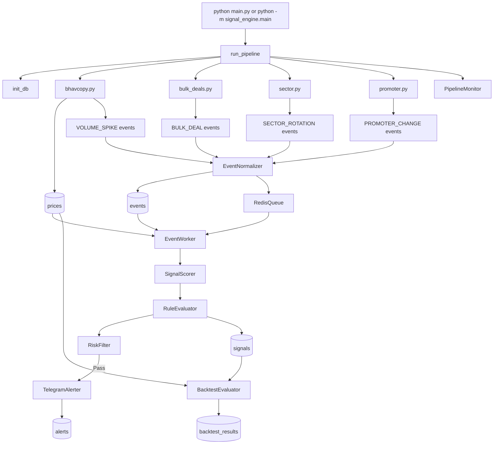

# Event-Driven Stock Signal Engine

 
[](https://www.python.org/)
[](https://www.sqlite.org/)
[](https://redis.io/)
[](https://core.telegram.org/bots/api)
[](https://pytest.org/)


A post-market event-driven stock signal pipeline for Indian equities using NSE public market files.
The engine ingests daily market data, detects event patterns, scores confidence, filters risk, and sends Telegram alerts for qualified signals.

## Overview

After market closes, the pipeline runs in this order:

1. Download daily market data.
2. Detect unusual market activity.
3. Convert that activity into events.
4. Combine same-stock same-day events.
5. Score them into one confidence value.
6. Apply rule boosts and risk filters.
7. Send Telegram alerts.
8. Backtest alerted signals later.

If Redis isn't running, it falls back to an in-memory queue. If any pipeline stage fails, the rest still run.

## Important Note About "Realtime"

This project is not tick-by-tick intraday streaming.
It is designed as a post-market or end-of-day pipeline.

Why:

- The main price source is NSE bhavcopy.
- Bulk deals, sector lists, and promoter/shareholding data are file-based public sources.
- Those sources are naturally processed after market activity is already recorded.


## Architecture Diagram



## How the Pipeline Works

When you run:

```powershell
python main.py --date 2026-04-29
```

1. Opens or creates the SQLite database.
2. Downloads and parses bhavcopy.
3. Validates price quality.
4. Stores valid price rows in `prices`.
5. Downloads bulk deals and emits `BULK_DEAL` events.
6. Detects `VOLUME_SPIKE` events from historical price/volume data.
7. Loads sector membership and emits `SECTOR_ROTATION` events.
8. Downloads promoter/shareholding files and emits `PROMOTER_CHANGE` events.
9. Normalizes and deduplicates all events.
10. Pushes normalized events into Redis.
11. Worker drains the queue.
12. Worker groups same-stock same-day events.
13. Scoring engine calculates confidence.
14. Rule evaluator applies score boosts.
15. Risk filter rejects unsafe signals.
16. Telegram alerter sends alerts for qualified signals.
17. Backtest evaluator later measures performance of alerted signals.
18. Monitoring logger records pipeline status and queue health.

Important behavior in the current code:

- each pipeline phase is wrapped in a safe runner
- if one phase fails, the pipeline logs the failure and continues to the next phase where possible
- this makes the run more resilient during live operation


## Project layout

```
signal_engine/
├── producers/        # bhavcopy, bulk_deals, sector, promoter
├── validation/       # data quality checks, backtest evaluation
├── normalization/    # dedup and diversity scoring
├── queue/            # Redis queue with in-memory fallback
├── workers/          # event consumer and signal builder
├── scoring/          # confidence formula
├── rules/            # score boost combinations
├── risk/             # liquidity, volatility, regime filters
├── alerts/           # Telegram sender
├── monitoring/       # structured JSON logs
├── db/               # SQLite schema
└── config/           # settings.yaml, rules.yaml
```

## Configuration Files

### `signal_engine/config/settings.yaml`

Current runtime configuration:

```yaml
database:
  path: signal_engine.db

redis:
  host: localhost
  port: 6379
  db: 0

signal_weights:
  VOLUME_SPIKE: 0.30
  BULK_DEAL: 0.35
  SECTOR_ROTATION: 0.20
  PROMOTER_CHANGE: 0.15

risk_filter:
  min_avg_volume: 100000
  max_volatility: 0.05
  min_market_return_20d: -5.0
  min_confidence: 3.0
  signal_validity_days: 2

alert_threshold: 5.0

volume_spike:
  zscore_threshold: 2.5
  lookback_days: 20

sector_rotation:
  relative_strength_std_threshold: 1.5
  lookback_days: 5

promoter_change:
  min_change_pct: 1.0
```

### `signal_engine/config/rules.yaml`

Stores score boosting rule combinations.

### `.env`

Real secrets go here locally:

```env
TELEGRAM_TOKEN=your_real_bot_token
TELEGRAM_CHAT_ID=your_real_chat_id
```

Never commit `.env`.

## Setup and Run Guide

### 1. Clone the repository

```powershell
git clone https://github.com/elvishpatel/SignalEngine/
cd signal_engine
```

### 2. Create virtual environment

```powershell
py -3.10 -m venv .venv
.\.venv\Scripts\Activate.ps1
```

### 3. Install dependencies

```powershell
pip install -r requirements.txt
```

### 4. Configure Telegram secrets

Copy `.env.example` to `.env` and fill in your real values.

Example:

```env
TELEGRAM_TOKEN=your_bot_token_here
TELEGRAM_CHAT_ID=your_chat_id_here
```

### 5. Start Redis

Example using Docker Desktop on Windows:

```powershell
docker run -d --name redis-local -p 6379:6379 redis:7
```

### 6. Run tests

```powershell
pytest tests -q
```

### 7. Initialize database

```powershell
python -m signal_engine.db.schema
```

### 8. Run one manual pipeline

```powershell
python main.py --date 2026-04-29
```

### 9. Run scheduler mode

```powershell
python main.py --schedule
```

Important scheduler note:

- current code uses the machine local timezone
- for Indian market automation, keep the machine time set to IST if that is your intended schedule

## Troubleshooting

### Case 1: `prices > 0` but `events = 0`

Meaning:

- data was downloaded and stored
- no event threshold was crossed

Possible reasons:

- no strong volume spike
- no bulk deal of significance
- no strong sector rotation
- no promoter change above threshold
- insufficient lookback data for event generation

### Case 2: `events > 0` but `signals = 0`

Meaning:

- events exist
- worker path did not finish signal creation as expected

Check:

- Redis availability
- worker logs
- whether normalized events were pushed and drained correctly

### Case 3: `signals > 0` but `alerts = 0`

Meaning:

- signal was created
- confidence threshold or risk filter blocked alerting

Check:

- `confidence`
- `alert_threshold`
- liquidity rule
- volatility rule
- market regime rule
- expiry rule

### Case 4: Telegram manual send works but pipeline sends nothing

Meaning:

- Telegram setup is correct
- the real blocker is event generation or risk filtering


## Contributing

Built by [Elvish Patel](https://github.com/elvishpatel).

PRs are welcome. If you're adding a new event producer, follow the same structure as any file in `signal_engine/producers/` and include at least one test in `tests/test_producers.py`.

For non-trivial changes, open an issue first so we can align before you spend time building. Keep PRs focused — one change per PR makes review a lot easier.
